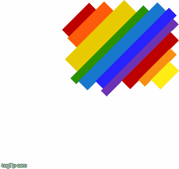
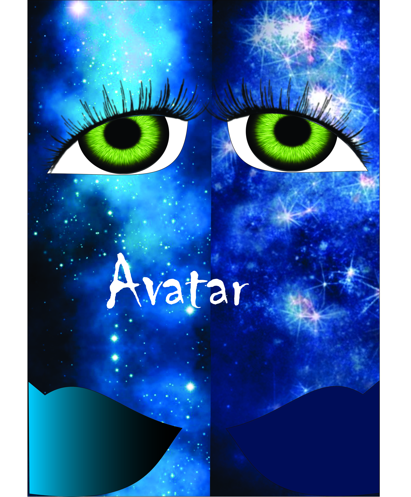
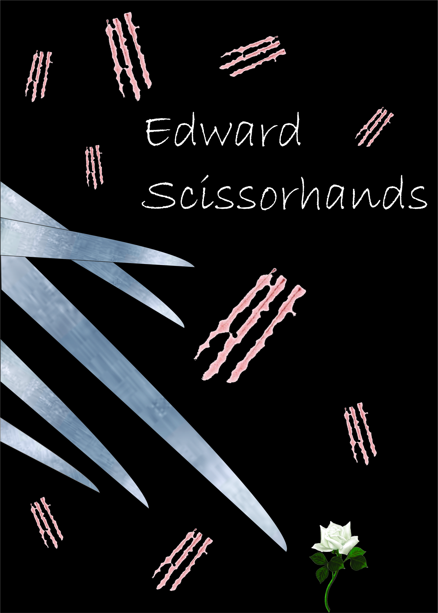

# Portifólio de Jogos Digitais  

__João Pedro, estudante de Programação de Jogos Digitais no IFRN - Ceará Mirim.__ 

Contatos:  
[LinkedIn](https://www.linkedin.com/in/jo%C3%A3o-pedro-85441294/)  
E-mail: pedro.pedro191@gmail.com  
Instagran: @pedro_jones1  
 
 *** 

## Jogos desenvolvidos

#### Balder  
Parceiro: [Mychellangello](https://mychellangello.github.io/)  

#### Hybrid Child  
Parceiro: Matheus Costa

#### Pokemon vs Humanos  
Parceiro: Emmanuele e Matheus Ricardo
  

*** 

## Projetos Desenvolvidos

#### Projeto Integrador (PI) - JOGOS DIGITAIS COMO FONTE DE CONHECIMENTO DA CULTURA BUDISTA: EM FOCO O NIRVANA
Orientadores: Daniela Beny e Miguel Pereira

#### Projeto Integrador (PI) - The Heart Beat
Orientadores: Marcelo Barros

#### Projeto de Biologia - Gameterapia: uma forma de unir jogos digitais à reabilitação de pacientes acometidos pelo acidente vascular encefálico (AVE)
Orientadores: Videanny Videnov

#### Projeto de Empreendedorismo - Projeto Gamificando o Ensino do Empreendedorismo nas Escolas Públicas de Ceara-Mirim
Orientadores: Idelmarcia Dantas
 
 *** 

## Trabalhos  

[Tutorial Multi-idioma - Construct 2](https://drive.google.com/open?id=1xJXiLN-2qKVClKPrLnmwUOXI1nsXZThe)  
Parceiros: Mychellangello Paula, Guilherme Égle  
Disciplina: Motor de Jogos II

[Video Karatê](https://drive.google.com/open?id=0ByTqdVG3Df99SGhfbUZQNXg2OEk)  
Parceiros:Tailson Ferreira, Arnobio Duarte  
Disciplina: Educação física  

[Código C++ - Calculadora de Matrizes](https://drive.google.com/open?id=1absEUJ6C_xEygQxmqlB-d5spK6Ke3FUe)  
Parceiros: Marcelo Augusto, Mychellangello de Paula, Tailson Ferreira  
Disciplina: Matemática  

Animation  
Parceiros: Matheus Costa  
Disciplina: Oficina de Criação  
  

Influence Map  
Disciplina: Motor de Jogos II  

 ***

## Releituras  

Inspiração: Poster do Filme Avatar  

  

Inspiração: Poster do Filme Edward Mãos de Tesoura  

 

 ***
